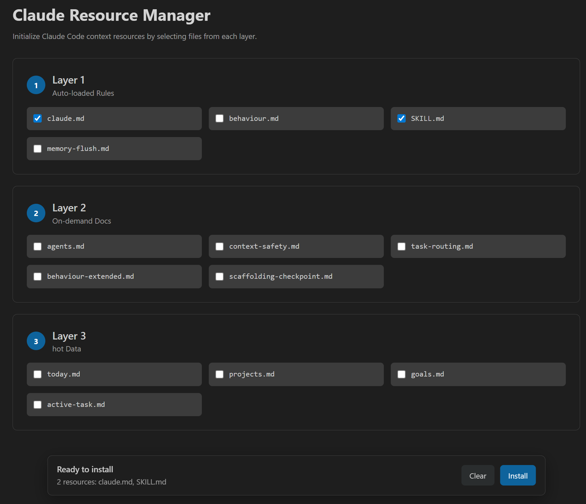

# 🤖 New Workbench Agent for VS Code

> **A visual interface for generating, installing, and managing AI agent workflows across VS Code, Claude Code, Cursor, GitHub Copilot, Aider, and more.**

<br/>

New Workbench Agent is a VS Code extension for setting up AI-assisted development workflows without manually copying prompts or configuration files. It provides a guided UI for selecting agents, installing tool-specific resources, and managing Claude Code context files from one workspace.

---

## ✨ Features

- 🎨 **Visual Agent Manager** - Select tools, departments, and agents from a focused UI.
- 🚀 **42+ Pre-built Agents** - Engineering, Design, Marketing, Testing, Product, Operations, and more.
- ⚡ **Quick Setup Presets** - Start from common workflows such as Full Stack, Rapid Prototyper, Design-First, and Growth-Focused.
- 🌲 **Sidebar Integration** - View installed agents, available agents, and Claude Code context resources.
- 🔄 **Auto-Refresh** - Detect changes to installed agent files automatically.
- ⚙️ **Custom Selection** - Install only the agents and resources you need.
- 🛠️ **Multi-Tool Support** - Works with Cursor, Claude Code, GitHub Copilot, Aider, and universal AI workflows.
- 👁️ **Agent Preview** - Review agent content before installing it.
- ⭐ **Favorites** - Star frequently used agents for faster access.
- 🔍 **Search** - Filter agents by name or description.
- 📚 **Claude Resource Manager** - Initialize Claude Code context resources by selecting files from each layer.

---

## 📦 Installation

The final installation path and package source will be updated before release.

### From VS Code Marketplace

1. Open VS Code.
2. Go to Extensions (`Ctrl+Shift+X` / `Cmd+Shift+X`).
3. Search for **"New Workbench Agent"**.
4. Click **Install**.

### From VSIX

Use the packaged extension path after it is published or built locally:

```bash
code --install-extension <path-to-new-workbench-agent.vsix>
```

### From Source

```bash
npm install
npm run build
```

Then press `F5` in VS Code to launch the Extension Development Host.

---

## 🚀 Quick Start

### 1. Open the Agent Manager

1. Open the Command Palette with `Ctrl+Shift+P` or `Cmd+Shift+P`.
2. Run **"New Workbench Agent: Open Agent Manager"**.
3. Choose the AI tool you want to configure.
4. Select the departments and agents that match your workflow.
5. Click **Install Agents**.

### 2. Use a Quick Setup Preset

1. Open the Command Palette.
2. Run **"New Workbench Agent: Quick Setup"**.
3. Select one of the available presets:
   - 🚀 **Full Stack Developer**
   - ⚡ **Rapid Prototyper**
   - 🎨 **Design-First**
   - 📈 **Growth-Focused**
   - 🏢 **Enterprise Team**

### 3. Manage From the Sidebar

1. Open the **New Workbench Agent** Activity Bar view.
2. Browse installed agents, available agents, and Claude Code context resources.
3. Use **Open Agent Manager** or **Init Resource Claude** when you need to install more resources.

---

## 📚 Claude Resource Manager

Initialize Claude Code context resources by selecting files from each layer. You can select one file, several files, or every file, then use the floating **Install** action to create the selected resources in your workspace.

### Layer 1: Auto-loaded Rules

- `claude.md`
- `behaviour.md`
- `SKILL.md`
- `memory-flush.md`

### Layer 2: On-demand Docs

- `agents.md`
- `context-safety.md`
- `task-routing.md`
- `behaviour-extended.md`
- `scaffolding-checkpoint.md`

### Layer 3: Hot Data

- `today.md`
- `projects.md`
- `goals.md`
- `active-task.md`

`SKILL.md` is installed to `.claude/skills/SKILL.md`. If a previous `SKILL.md` exists there, it is renamed to `SKILL.md-old` before the new file is created.

---

## 🏢 Available Agents

### **Design** (5 agents)

- `brand-guardian` - Brand consistency
- `ui-designer` - Interface design
- `ux-researcher` - User research
- `visual-storyteller` - Marketing visuals
- `whimsy-injector` - Delightful interactions

### **Engineering** (7 agents)

- `ai-engineer` - AI/ML integration
- `backend-architect` - API design
- `devops-automator` - CI/CD
- `frontend-developer` - UI implementation
- `mobile-app-builder` - iOS/Android
- `rapid-prototyper` - Fast MVPs
- `test-writer-fixer` - Testing

### **Marketing** (7 agents)

- `app-store-optimizer` - ASO
- `content-creator` - Blog/video content
- `growth-hacker` - Viral loops
- `instagram-curator` - Instagram strategy
- `reddit-community-builder` - Reddit engagement
- `tiktok-strategist` - TikTok marketing
- `twitter-engager` - Twitter/X

### **Product** (3 agents)

- `feedback-synthesizer` - User feedback
- `sprint-prioritizer` - Feature prioritization
- `trend-researcher` - Market trends

### **Project Management** (3 agents)

- `experiment-tracker` - A/B testing
- `project-shipper` - Launch coordination
- `studio-producer` - Cross-team coordination

### **Studio Operations** (5 agents)

- `analytics-reporter` - Metrics
- `finance-tracker` - Budget management
- `infrastructure-maintainer` - System reliability
- `legal-compliance-checker` - Privacy/compliance
- `support-responder` - Customer support

### **Testing** (5 agents)

- `api-tester` - API testing
- `performance-benchmarker` - Speed optimization
- `test-results-analyzer` - Test analysis
- `tool-evaluator` - Tool assessment
- `workflow-optimizer` - Process optimization

---

## 🛠️ Supported AI Tools

| Tool               | Folder         | How It Works                                    |
| ------------------ | -------------- | ----------------------------------------------- |
| **Cursor**         | `.cursorrules` | Use `@engineering/backend-architect.md` in chat |
| **Claude Code**    | `.claude`      | Native sub-agent and context resource support   |
| **GitHub Copilot** | `.github`      | Auto-loaded from `copilot-instructions.md`      |
| **Aider**          | `.aider`       | Conventions in `conventions.md`                 |
| **Universal**      | `.ai`          | Works with any AI tool                          |

---

## ⚙️ Configuration

### Settings

Open VS Code Settings (`Ctrl+,` or `Cmd+,`) and search for **"New Workbench Agent"**:

- **Default Tool** - Which AI tool to use by default.
- **Default Folder** - Custom folder name for agents.
- **Auto Refresh** - Automatically refresh when files change.
- **Show Welcome** - Show the welcome message on first use.
- **Default Departments** - Pre-selected departments.
- **Favorite Agents** - Starred agents managed through the UI.

### Commands

All commands are available from the Command Palette (`Ctrl+Shift+P` / `Cmd+Shift+P`):

- `New Workbench Agent: Open Agent Manager` - Open the visual manager.
- `New Workbench Agent: Quick Setup` - Install from a preset.
- `New Workbench Agent: Initialize Agents` - Run guided setup.
- `New Workbench Agent: Init Resource Claude` - Open Claude Resource Manager.
- `New Workbench Agent: Refresh Installed Agents` - Refresh sidebar views.
- `New Workbench Agent: Update Agents` - Update installed agents.
- `New Workbench Agent: Remove Agents` - Remove installed agent resources.
- `New Workbench Agent: Open Settings` - Open extension settings.

---

## 📚 Usage Examples

### With Cursor

After installation, use agents in Cursor:

```text
@engineering/backend-architect.md Design a REST API for user authentication
```

### With Claude Code

```bash
claude-code "Build a login page using the frontend-developer agent"
```

### With GitHub Copilot

GitHub Copilot automatically uses the instructions from `.github/copilot-instructions.md`.

---

## 🔍 Recent Updates

### Agent Preview

Click any agent in the **Available Agents** sidebar to preview its full content before installing. The preview opens in a side panel where you can review the agent's capabilities and decide whether it fits your workflow.

### Favorites

Star your most-used agents for quick access:

1. **From Sidebar**: Click the star icon next to any available agent.
2. **From Agent Manager**: Click the star next to any agent in the selection list.
3. **Quick Select**: Use the Favorites section in the Agent Manager to quickly toggle starred agents.

Favorites sync between the sidebar and the Agent Manager webview.

### Search

Use the search bar at the top of the Agent Manager to filter agents by name or description.

### Claude Resource Manager

Use the Claude Resource Manager to install layered Claude Code context files, including root instructions, on-demand docs, hot data files, and `.claude/skills/SKILL.md`.

---

## 🎯 Use Cases

**For Solo Developers:**

- Set up a complete AI-assisted development workflow.
- Get specialized guidance across engineering, product, design, and testing.
- Ship faster with repeatable agent configurations.

**For Startups:**

- Prototype quickly with specialized agents.
- Add marketing, growth, and launch support.
- Coordinate product and engineering work from one workspace.

**For Teams:**

- Standardize AI workflows across a team.
- Provide reusable context for common development tasks.
- Onboard new contributors faster.

---

## 🐛 Troubleshooting

### Agents not showing in sidebar

1. Click the refresh icon in the sidebar.
2. Or run `New Workbench Agent: Refresh Installed Agents`.

### Agents not working with Cursor

1. Restart Cursor after installing agents.
2. Make sure files exist in `.cursorrules/`.
3. Use `@` to mention agent files.

### Claude resources not appearing

1. Open **New Workbench Agent: Init Resource Claude**.
2. Select the resources you want to install.
3. Click the floating **Install** action.
4. Refresh the VS Code Explorer if needed.

### Extension not activating

1. Check your VS Code version. This extension requires `1.85.0` or newer.
2. Reload the window with `Ctrl+R` or `Cmd+R`.
3. Check the Output panel for errors.

---

## 🤝 Contributing

Found a bug or have a feature request?

- 🐛 **Report bugs**: [GitHub Issues](https://github.com/b0yblake/New-Workbench-Agent/issues)
- 💡 **Suggest features**: [GitHub Discussions](https://github.com/b0yblake/New-Workbench-Agent/discussions)
- 📖 **Documentation**: [GitHub Wiki](https://github.com/b0yblake/New-Workbench-Agent/wiki)

---

## 🙏 Credits

New Workbench Agent is powered by the existing core agent generation package used by this extension.

## 📄 License

This project is licensed under the **MIT License**. See the [LICENSE](./LICENSE) file for details.

---

Made with love by [b0yblake](https://github.com/b0yblake)
