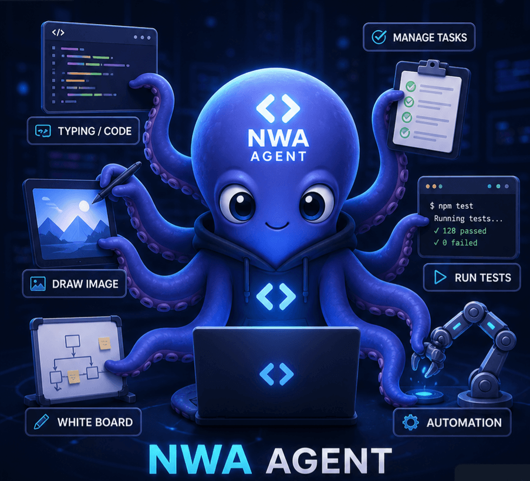
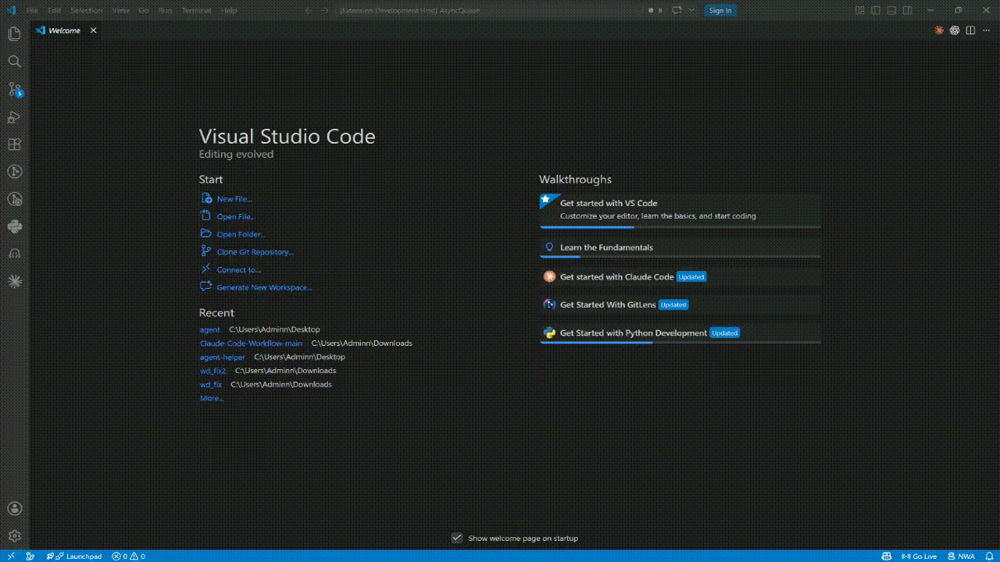

# 🐙 New Workbench Agent for VS Code

> **A visual interface for generating, workflow creating, and managing AI agent across VS Code, Claude Code, Cursor, GitHub Copilot, Aider, and more.**

<p align="center"></p>

**A Human-Controlled AI Workbench for Developers, is not built to replace developers.**
<br/>It is built to give developers full control over how multiple agents think, work, adapt, and deliver.

## ✨ Why does this repo exist?

| Pain Point | How NWA Agent Solves It | Value for Developers |
|---|---|---|
| 🤖 Too many multi-agent tools are shallow | NWA Agent brings agents directly into VS Code | Developers can work with AI inside their real coding environment, not through a disconnected automation layer. |
| 🔒 Most workflows are rigid and hard to customize | Modular agent configuration and reusable resources | Teams can create, adjust, and reuse specialized agents based on each project’s needs. |
| 🏃 Agents often run from start to finish like a black box | Human-in-the-loop workflow control | Developers can stay involved, guide the process, and make decisions at the right moments. |
| 🔁 It is hard to change direction while an agent is running | Mid-flow customization and intervention | Developers can pause, refine instructions, switch context, or adjust the agent’s role without restarting everything. |
| 🧠 Context is scattered and difficult to manage | Project memory and context management | Instructions, resources, and task knowledge stay organized in one workbench. |
| ⚙️ Developers need speed, but not at the cost of control | Multi-agent coordination with developer oversight | NWA Agent combines AI execution speed with developer judgment, flexibility, and precision. |

---

## 🪴 Quick demo



---

## 📦 Installation

The final installation path and package source will be updated before release.

### From VS Code Marketplace

1. Open VS Code.
2. Go to Extensions (`Ctrl+Shift+X` / `Cmd+Shift+X`).
3. Search for **"New Workbench Agent"**.
4. Click **Install**.

### From VSIX

Use the packaged extension path after it is published or built locally:

```bash
code --install-extension <path-to-new-workbench-agent.vsix>
```

### From Source

```bash
npm install
npm run build
```

Then press `F5` in VS Code to launch the Extension Development Host.

---

## 🚀 Quick Start

### 1. Open the Agent Manager

1. Open the Command Palette with `Ctrl+Shift+P` or `Cmd+Shift+P`.
2. Run **"New Workbench Agent: Open Agent Manager"**.
3. Choose the AI tool you want to configure.
4. Select the departments and agents that match your workflow.
5. Click **Install Agents**.

### 2. Use a Quick Setup Preset

1. Open the Command Palette.
2. Run **"New Workbench Agent: Quick Setup"**.
3. Select one of the available presets:
   - 🚀 **Full Stack Developer**
   - ⚡ **Rapid Prototyper**
   - 🎨 **Design-First**
   - 📈 **Growth-Focused**
   - 🏢 **Enterprise Team**

### 3. Manage From the Sidebar

1. Open the **New Workbench Agent** Activity Bar view.
2. Browse installed agents, available agents, and Claude Code context resources.
3. Use **Open Agent Manager** or **Init Resource Claude** when you need to install more resources.

---

## 📚 Claude Resource Manager

Initialize Claude Code context resources by selecting files from each layer. You can select one file, several files, or every file, then use the floating **Install** action to create the selected resources in your workspace.

### Layer 1: Auto-loaded Rules
### Layer 2: On-demand Docs
### Layer 3: Hot Data

`SKILL.md` is installed to `.claude/skills/SKILL.md`. If a previous `SKILL.md` exists there, it is renamed to `SKILL.md-old` before the new file is created.

---

## ⚙️ Configuration

### Settings

Open VS Code Settings (`Ctrl+,` or `Cmd+,`) and search for **"New Workbench Agent"**:

- **Default Tool** - Which AI tool to use by default.
- **Default Folder** - Custom folder name for agents.
- **Auto Refresh** - Automatically refresh when files change.
- **Show Welcome** - Show the welcome message on first use.
- **Default Departments** - Pre-selected departments.
- **Favorite Agents** - Starred agents managed through the UI.

### Commands

All commands are available from the Command Palette (`Ctrl+Shift+P` / `Cmd+Shift+P`):

- `New Workbench Agent: Open Agent Manager` - Open the visual manager.
- `New Workbench Agent: Quick Setup` - Install from a preset.
- `New Workbench Agent: Initialize Agents` - Run guided setup.
- `New Workbench Agent: Init Resource Claude` - Open Claude Resource Manager.
- `New Workbench Agent: Refresh Installed Agents` - Refresh sidebar views.
- `New Workbench Agent: Update Agents` - Update installed agents.
- `New Workbench Agent: Remove Agents` - Remove installed agent resources.
- `New Workbench Agent: Open Settings` - Open extension settings.

## 🐛 Troubleshooting

### Agents not showing in sidebar

1. Click the refresh icon in the sidebar.
2. Or run `New Workbench Agent: Refresh Installed Agents`.

### Agents not working with Cursor

1. Restart Cursor after installing agents.
2. Make sure files exist in `.cursorrules/`.
3. Use `@` to mention agent files.

### Claude resources not appearing

1. Open **New Workbench Agent: Init Resource Claude**.
2. Select the resources you want to install.
3. Click the floating **Install** action.
4. Refresh the VS Code Explorer if needed.

### Extension not activating

1. Check your VS Code version. This extension requires `1.85.0` or newer.
2. Reload the window with `Ctrl+R` or `Cmd+R`.
3. Check the Output panel for errors.

---

## 🤝 Contributing

Found a bug or have a feature request?

- **Critical project discussions**: [GitHub Discussions](https://github.com/b0yblake/New-Workbench-Agent/discussions)
- 🐛 **Report bugs**: [GitHub Issues](https://github.com/b0yblake/New-Workbench-Agent/issues)
- 💡 **Suggest features**: [GitHub Discussions](https://github.com/b0yblake/New-Workbench-Agent/discussions)
- 📖 **Documentation**: [GitHub Wiki](https://github.com/b0yblake/New-Workbench-Agent/wiki)

---

## 📄 License

This project is licensed under the **MIT License**. See the [LICENSE](./LICENSE) file for details.

---

Made with love by [b0yblake](https://github.com/b0yblake)
